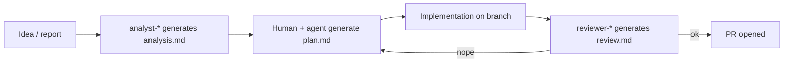
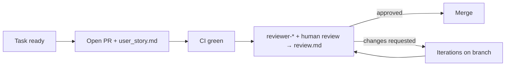

# `.workspace/` — Process material

> This folder is **excluded from the repository** (root `.gitignore`). It holds the material that accompanies every PR and every Task during the development lifecycle: artifacts targeted at humans and agents, but not part of the public product.

## Why it exists

Document-as-Code says: *the public product is code + documentation versioned together*. But there is a gray area of **process material** (user stories, preliminary analyses, implementation plans, review outcomes) that does not belong in the public repository — it would be noise — yet must live next to the code so sub-agents can consult it while they work.

The solution: a local folder, ignored by version control, with a stable conventional structure.

## Layout

```
.workspace/
├── pr/
│   └── PR-NNN-<slug>/
│       ├── user_story.md       ← why we are doing this PR
│       └── review.md           ← review outcome (human and/or reviewer-* agent)
└── task/
    └── TASK-NNN-<slug>/
        ├── analysis.md         ← analyst-* agent output
        ├── plan.md             ← step-by-step implementation plan
        └── review.md           ← post-implementation review outcome
```

## Naming conventions

- `NNN`: three-digit progressive number. **Do not reuse** numbers: even if you delete PR-007, the next one is PR-008.
- `<slug>`: kebab-case, short, descriptive (`PR-014-cache-search-results`, not `PR-014-fix`).
- Slug and document title must stay coherent throughout the whole lifecycle.

## Typical Task pipeline



## Typical PR pipeline



## Templates

See the examples `pr/PR-001-…` and `task/TASK-001-…` in this same folder: they are meant to be cloned as a skeleton for the next Task / PR.

## What does NOT belong here

- Executable code: lives under `src/`.
- Product documentation (technical analysis, functional analysis): lives under `docs/`.
- Secrets, tokens, credentials: do not live *anywhere* in the repo, not even here (even though the folder is ignored, it still ends up on the disk of anyone cloning the repo).
