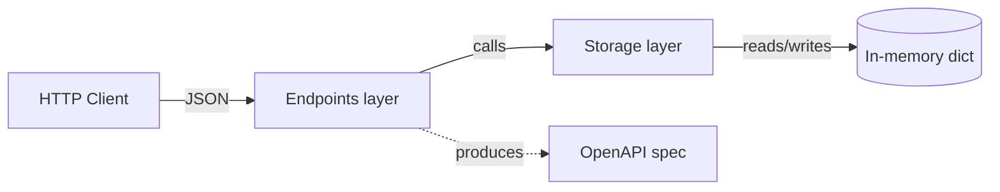
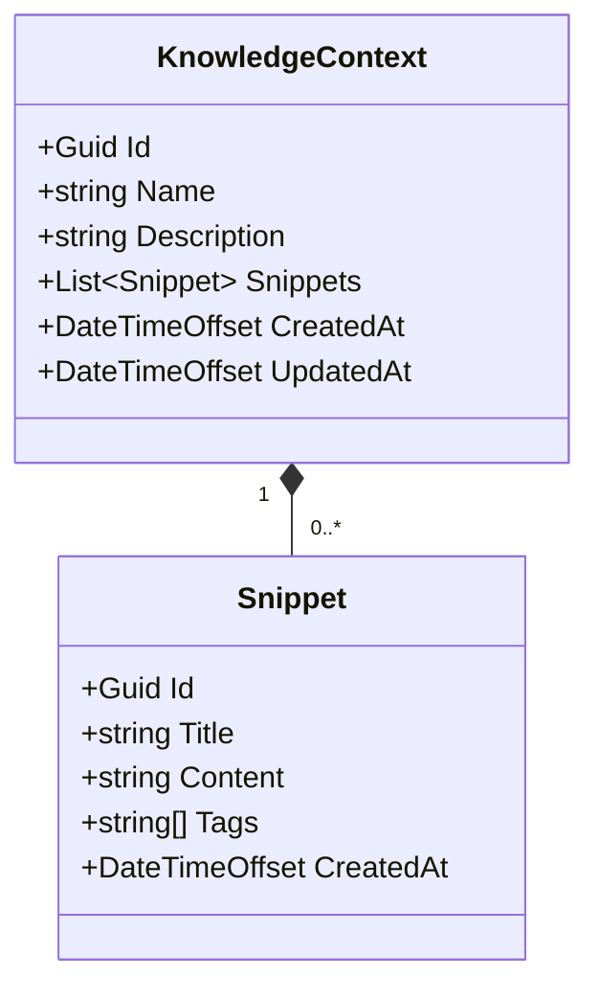

# Technical analysis — Context Manager API

> **Purpose of this document.** Describe *how* the application is built: architecture, layering, HTTP contracts, data model, design decisions and their rationale. It is the technical counterpart to the [functional analysis](./functional-analysis/00-index.md), which instead describes *what* the system must do in domain terms.

## Table of Contents

1. [Technology stack](#1-technology-stack)
2. [Architecture](#2-architecture)
3. [Data model](#3-data-model)
4. [HTTP contracts](#4-http-contracts)
5. [Persistence](#5-persistence)
6. [Concurrency and thread-safety](#6-concurrency-and-thread-safety)
7. [Observability](#7-observability)
8. [Design decisions](#8-design-decisions)
9. [Known limits and future work](#9-known-limits-and-future-work)

---

## 1. Technology stack

| Component | Version | Notes |
|-----------|---------|-------|
| Runtime / SDK | .NET 10 | LTS, target `net10.0` |
| Web framework | ASP.NET Core Minimal API | No MVC controllers |
| OpenAPI | `Microsoft.AspNetCore.OpenApi` 10.0.0 | Native provider, replaces Swashbuckle |
| Language | C# 13 | `Nullable enable`, `ImplicitUsings enable` |
| Persistence | In-memory (`ConcurrentDictionary`) | Non-durable state |
| Tests | — | Out of scope for this demo |

## 2. Architecture

Composition of three very thin layers. No hypertrophic *clean architecture*: complexity is proportional to the domain.



| Layer | Responsibility | Files |
|-------|----------------|-------|
| **Endpoints** | Routing, binding, HTTP status codes | `Endpoints/ContextEndpoints.cs`, `Endpoints/SnippetEndpoints.cs` |
| **Storage** | CRUD, search, state consistency | `Storage/IContextStore.cs`, `Storage/InMemoryContextStore.cs` |
| **Models** | Request DTOs + domain entities (immutable records) | `Models/KnowledgeContext.cs`, `Models/Snippet.cs` |

Composition root in `Program.cs`:

```csharp
builder.Services.AddSingleton<IContextStore, InMemoryContextStore>();
```

Singleton because state is in-memory and must be shared across requests; the implementation is thread-safe (see §6).

## 3. Data model



All entities are `record sealed`: update via `with`-expression, runtime immutability, value equality.

## 4. HTTP contracts

### `POST /contexts`

Creates a new Knowledge Context.

- **Body**: `{ "name": string, "description": string }`
- **201 Created** + body with the full entity
- `Location: /contexts/{id}`

### `GET /contexts`

- **200 OK** + array of contexts (possibly empty)

### `GET /contexts/{id}`

- **200 OK** + entity
- **404 Not Found** if the id does not exist

### `PUT /contexts/{id}`

- **Body**: `{ "name": string, "description": string }`
- **200 OK** + updated entity, **404** if not found
- Refreshes `UpdatedAt`

### `DELETE /contexts/{id}`

- **204 No Content**, **404** if not found

### `POST /contexts/{contextId}/snippets`

- **Body**: `{ "title": string, "content": string, "tags": string[] }`
- **201 Created** + snippet entity, **404** if the context does not exist

### `GET /contexts/{contextId}/search?q={query}`

- **200 OK** + array of snippets
- **404** if the context does not exist
- If `q` is missing or empty, returns *all* snippets of the context
- Case-insensitive match on `Title`, `Content`, and any `Tag`

## 5. Persistence

`ConcurrentDictionary<Guid, KnowledgeContext>` in memory. State is lost on every restart.

Accepted consequences:

- Suitable for demos, exploratory tests, presentations.
- Not suitable for real use: no durability, no backup, no replication.

The `IContextStore` interface is the extension point for alternative persistence (SQLite, EF Core, Cosmos) without touching the endpoints.

## 6. Concurrency and thread-safety

- `ConcurrentDictionary` handles concurrency on keys.
- Update and `AddSnippet` operations use a *read-modify-write* pattern: under concurrent writes to the same `Id` the last writer wins (last-writer-wins). Acceptable for the demo.
- Strict serialization on a single context would require a per-id lock or an `AddOrUpdate` API with an atomic factory. Out of scope.

## 7. Observability

To stay minimal:

- Logging: ASP.NET Core defaults (`ILogger` console).
- Metrics, distributed tracing, health checks: **not provided**.

Natural extension: `app.MapHealthChecks("/healthz")` and an OpenTelemetry exporter.

## 8. Design decisions

| Decision | Rejected alternative | Rationale |
|----------|----------------------|-----------|
| Minimal API | MVC controllers | Minimum surface, demo readable in <100 lines |
| Immutable records | Mutable POCO classes | Value equality, `with` for updates, no shared-state bugs |
| In-memory store | SQLite / EF Core | Zero setup, focus on the DaC theme |
| Native OpenAPI | Swashbuckle | In .NET 10 the native provider is sufficient |
| Linear in-memory search | Full-text indexes | Small volumes, complexity unjustified |

## 9. Known limits and future work

- **No authentication / authorization.** Public API.
- **No input validation** beyond model binding. In a real version: `MinimalApis.Extensions.Validation` or FluentValidation.
- **O(n) search** over the full snippet collection of a context: fine up to a few thousand.
- **No pagination** on `GET /contexts` or on `search`.
- **No update conflict handling** (ETag / If-Match).

All of these points are *consciously* out of scope for the demo: addressing them would be an exercise in over-engineering contrary to the spirit of the document.
